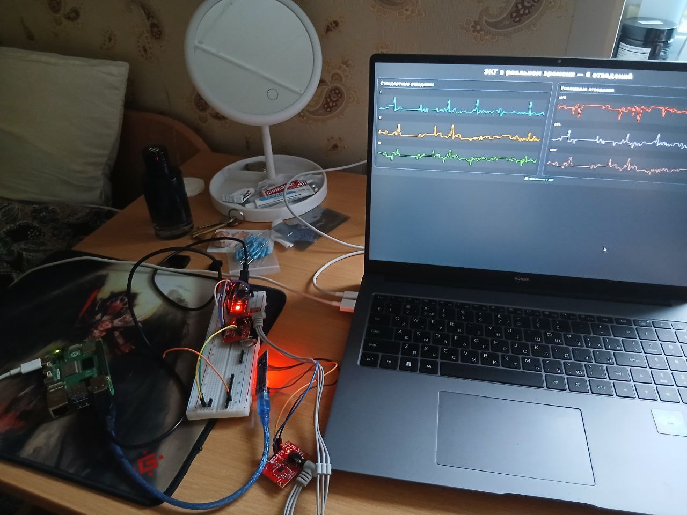

# 🫀 IoT-система мониторинга ЭКГ с ИИ-анализом в реальном времени

Портативное edge-устройство на базе **Raspberry Pi 5**, которое регистрирует, визуализирует и автоматически интерпретирует **электрокардиограмму (ЭКГ)**.  
Система работает **локально**, без зависимости от облака, и предоставляет публичный доступ через reverse proxy — идеально для телемедицины, учебных целей и домашнего скрининга.


---

## 💡 Физическая основа: регистрация электрической активности сердца

Сердце генерирует **биоэлектрические импульсы**, возникающие при деполяризации и реполяризации кардиомиоцитов. Эти потенциалы распространяются по тканям тела и могут быть зарегистрированы с поверхности кожи с помощью электродов.

ЭКГ отражает **временную динамику разности потенциалов** между различными точками тела. Классическая 12-канальная ЭКГ использует 10 электродов, но уже **три отведения** (I, II, III) позволяют восстановить основную информацию о векторе электрической активности сердца в фронтальной плоскости — это **закон Эйнтховена**:

- **I = L − R**  
- **II = F − R**  
- **III = F − L**

где **R**, **L**, **F** — потенциалы на правой руке, левой руке и левой ноге соответственно. На основе этих трёх отведений вычисляются униполярные усиленные отведения:

- **aVR = −(I + II)/2**  
- **aVL = I − II/2**  
- **aVF = II − I/2**

В нашем проекте мы используем **два физических канала (I и II)**, считанных с модуля **AD8232**, и программно восстанавливаем все **шесть стандартных отведений** по приведённым формулам. Это позволяет сократить аппаратную сложность, сохранив клинически значимую информацию.

Для повышения качества сигнала применяется **полосовой фильтр 0.5–40 Гц** (фильтр Баттерворта 4-го порядка), устраняющий дрейф базовой линии и высокочастотный шум (мышечные артефакты, помехи сети).

---

## 🌟 Возможности

- Запись ЭКГ в реальном времени с датчика **AD8232** через **Arduino Nano**
- Восстановление **6 отведений** (I, II, III, aVR, aVL, aVF) по формулам Эйнтховена
- Полосовая фильтрация (**0.5–40 Гц**) и нормализация сигнала
- Автоматическая классификация **19 кардиологических патологий** (аритмии, блокады, синдромы)
- Веб-интерфейс с **live-графиками** и кнопкой анализа
- Публичный доступ через **frp** (без статического IP)
- Админ-панель **frp** и поддержка пользователей через **Candy** (веб-чат)

---

## 🧠 Архитектура системы

```
AD8232 + Arduino Nano 
        ↓ (Serial → pyserial)
Raspberry Pi 5 (Edge)
  ├─ Приём и обработка сигнала (фильтрация, восстановление отведений)
  ├─ Локальный ИИ-анализ (TorchScript, CPU-only inference)
  └─ FastAPI + WebSocket → веб-интерфейс
        ↓ (frp reverse tunnel)
VPS (159.255.36.113)
  ├─ frps: проброс портов + админка (порт 7500)
  └─ Candy: веб-чат для поддержки
```

> Модель обучена в **Podman-контейнере** на **Fedora Silverblue** с использованием датасета **PTB-XL** (~21 800 записей).

---

## 🛠️ Установка

### Требования
- Raspberry Pi 5 (4 ГБ RAM или больше)
- AD8232 ECG Sensor
- Arduino Nano
- Электроды (медицинские или самодельные)
- VPS с публичным IP (для frp)

### На Raspberry Pi
```bash
sudo apt update && sudo apt install python3 python3-pip
pip3 install fastapi uvicorn pyserial torch numpy scipy

git clone https://github.com/ваш-логин/ecg-iot.git
cd ecg-iot

cd ./rp && ./venv/bin/activate
uvicorn main:app --host localhost --port 8000 --reload --log-level debug
```

### На VPS (для frp)
```bash
./frps -c frps.toml
```

Настройте `frpc` на Raspberry Pi для проброса порта (например, `8000 → 8001`).

> Интерфейс: http://159.255.36.113:8001  
> Админка frp: http://159.255.36.113:7500

---

## 🖥️ Веб-интерфейс

- Live-графики всех 6 отведений
- Автоматическое сохранение 10-секундных записей
- Анализ последней записи по кнопке **«Получить прогноз»**
- Возможность загрузки своих `.npy`-файлов для повторного анализа

---

## ⚠️ Важно

- Это **прототип для скрининга**, а не сертифицированный медицинский прибор.
- Результаты ИИ **не заменяют консультацию врача**.
- Качество сигнала сильно зависит от **контакта электродов** и положения тела.

---

## 📚 Технологии

### Аппаратная часть
- **AD8232** — аналоговый фронт-энд для регистрации биопотенциалов
- **Arduino Nano** — сбор данных по UART
- **Raspberry Pi 5** — edge-вычисления и запуск ИИ

### Программный стек
- **Python 3**, **FastAPI**, **WebSocket**, **pyserial**
- **NumPy/SciPy** — обработка сигналов (фильтрация, формулы Эйнтховена)
- **PyTorch + TorchScript** — ИИ-модель для мультилейбл-классификации (19 классов)
- **PTB-XL** — датасет для обучения
- **Chart.js + Jinja2** — веб-визуализация
- **frp + Candy** — инфраструктура и поддержка

---

## 📓 Особенности реализации

- **Edge-first**: инференс на Raspberry Pi, без облака
- **Физически обоснованная реконструкция** отведений по закону Эйнтховена
- **Асинхронная архитектура**: Serial-чтение в фоне + async FastAPI
- **Автосохранение**: каждые 10 секунд
- **Минималистичный hardware**: всего два физических канала → шесть клинических отведений

---

