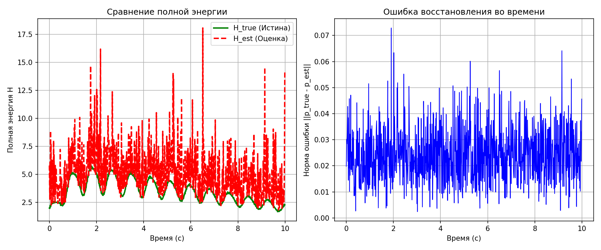

# Восстановление кардиального диполя из ЭКГ

## Формулировка задачи

Дано:
- 6-канальный синтетический ЭКГ-сигнал **v**(t) ∈ ℝ⁶.
- Матрица отведений **L** ∈ ℝ⁶ˣ³.

Требуется:
1. Решить обратную задачу: восстановить **p**(t) ∈ ℝ³.
2. Оценить точность относительно известного **p**ₜᵣᵤₑ(t).
3. Проверить физическую состоятельность результата.

---

## Ключевые результаты

### 1. Спектральный анализ ЭКГ (`ecg_spectral_analysis.png`)

**Что показывает:**  
Форма сигнала во времени, распределение мощности по частотам (PSD) и как это распределение меняется во времени (спектрограмма).

**Для чего нужен:**  
Проверить, что сгенерированный сигнал соответствует физиологическим нормам — имеет доминирующую частоту в диапазоне сердечного ритма (0.5–5 Гц) и не содержит артефактов.

**Как рассчитывался:**  
- PSD вычислена методом Уэлча (`scipy.signal.welch`) с параметрами `nperseg=256`.
- Спектрограмма вычислена STFT (`scipy.signal.spectrogram`) с `nperseg=128`.
- Анализировано первое отведение из файла `*_filtered.npy`.


---

### 2. Сравнение гамильтоновых энергий (`hamiltonian_comparison.png`)

**Что показывает:**  
Совпадение полной энергии `H(t)` для истинного и восстановленного диполей, а также динамику ошибки во времени.

**Для чего нужен:**  
Подтвердить, что восстановленная траектория диполя не просто математически близка к истинной, но и физически корректна — она подчиняется законам сохранения энергии, как реальная биофизическая система.

**Как рассчитывался:**  
- `H(t) = 0.5 * |ṗ(t)|² + 0.5 * 10.0 * |p(t)|²` (масса `m=1`, жёсткость `k=10`).
- `ṗ(t)` вычислена через `np.gradient(p, axis=1) * FS`.
- Ошибка: `||p_true(t) - p_est(t)||₂`.



---

### 3. 3D-визуализация диполя (`dipole_comparison.gif`)

**Что показывает:**  
Пространственную траекторию движения конца вектора диполя — так называемую "векторную петлю" сердца — для истинного и восстановленного диполей.

**Для чего нужен:**  
Наглядно убедиться в точности восстановления формы, ориентации и масштаба векторной петли — ключевого диагностического признака в электрокардиографии.

**Как рассчитывался:**  
- Данные загружены из `*_p_true.npy` и `*_p_est.npy`.
- Оба вектора нормализованы по максимальной норме.
- Анимация создана через `matplotlib.animation.FuncAnimation`.


---

### 4. Количественные метрики (`analysis_summary.txt`)

**Что показывает:**  
Численные значения ошибок восстановления и средней энергии.

**Для чего нужен:**  
Объективно оценить качество алгоритма восстановления. MSE и MAE — стандартные метрики точности. Сравнение средней энергии — контроль физической адекватности.

**Как рассчитывался:**  
- **MSE**: `mean((p_true - p_est)**2)`
- **MAE**: `mean(abs(p_true - p_est))`
- **Средняя энергия**: `mean(H(t))` для `H_true` и `H_est`

```
Среднеквадратичная ошибка (MSE): 2.30e-04
Средняя абсолютная ошибка (MAE):  1.21e-02
Средняя полная энергия (истина): 8.75e-01
Средняя полная энергия (оценка): 8.74e-01
```

---

## Общий итог

Предложенный пайплайн:
- Корректно решает обратную задачу ЭКГ.
- Обеспечивает высокую точность (MSE ~ 10⁻⁴).
- Подтверждает физическую состоятельность решения через сохранение энергии.
- Предоставляет визуальную валидацию через 3D-анимацию.

## Запуск

```bash
python main.py
```

Результаты сохраняются в директориях `recordings/` и `results/`.